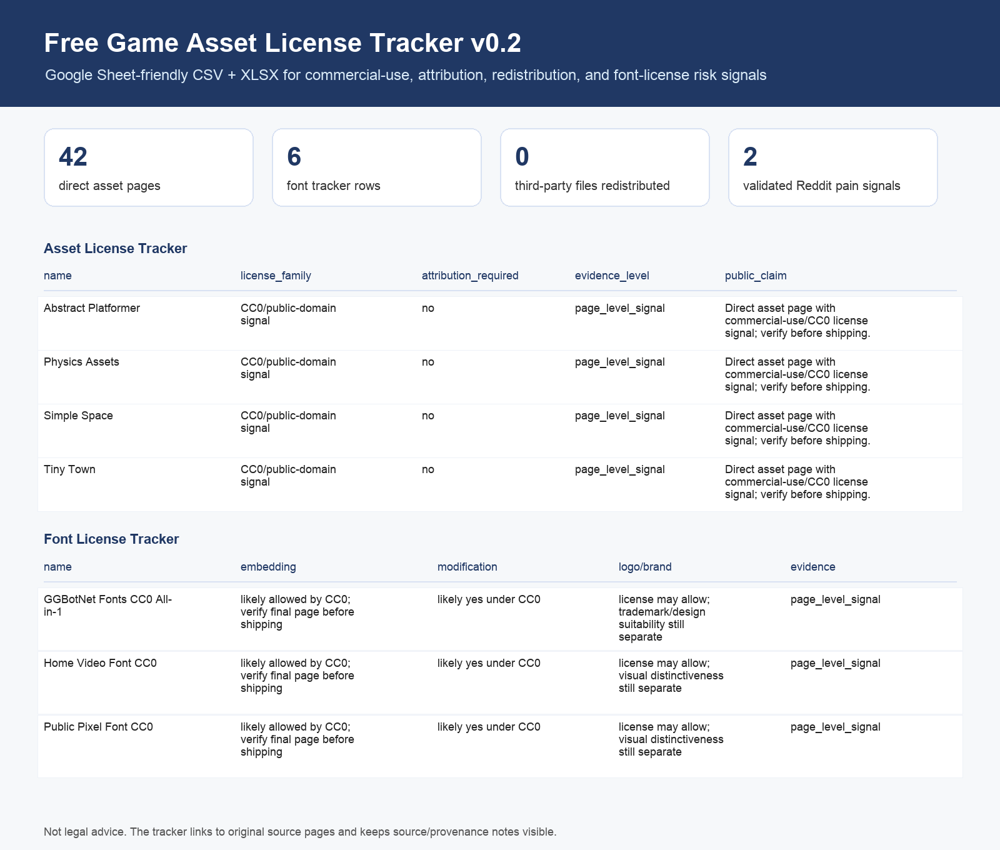

# Free Game Asset License Tracker

This is a starter license tracker for indie game developers who need free game assets with clearer commercial-use, attribution, redistribution, and font-embedding signals.

## What This Is

- 42 direct asset pages with commercial-use/CC0 license signals.
- 8 additional rows are license/reference/discovery sources, not direct asset packs.
- Each row records source URL, asset type, license signal, attribution requirement, redistribution risk, signup friction, and audit status.
- The `row_type` column marks whether a row is an `asset_page`, `license_or_source_reference`, or `discovery_pool`.
- This sheet links to original creator/source pages. It does not redistribute third-party asset files.
- Current strict audit status: `conditional_pass`. See `AUDIT_REPORT.md`.

## v0.2 Files

- `free_game_asset_license_tracker_v0.2.xlsx`: Excel/Google Sheets-ready workbook with Summary, Asset License Tracker, Font License Tracker, and Field Guide tabs.
- `game_asset_license_tracker_v0.2.csv`: Google Sheet-friendly general asset tracker with `license_family`, `evidence_level`, `last_checked`, and `public_claim`.
- `font_license_tracker_v0.2.csv`: font-specific tracker with fields for embedding, modification, logo/brand use, editorial vs commercial use, and redistribution risk.
- `preview_license_tracker_v0.2.png`: visual preview for Reddit/social posts.

## Optional Pro Preview

The free tracker is the main public version.

There is also a small paid Pro Preview for people who want the expanded workbook:

- 75 total asset tracker rows.
- 25 Pro-only extra rows beyond the free tracker.
- CC0 Signals tab.
- Pro Extra Rows tab.
- Buyer README and changelog.

Gumroad: https://3813941972097.gumroad.com/l/grjtiq

The Pro Preview sells the audit structure, filtering, source notes, and risk flags. It does not sell or redistribute third-party asset files.

## CC0-only Game Jam Starter

There is also a narrower free companion package for game jams:

- `cc0-game-jam-starter-v0.1/cc0_game_jam_starter_v0.1.xlsx`: workbook with Summary, CC0 Starter, Game Jam Checklist, and Source Notes tabs.
- `cc0-game-jam-starter-v0.1/cc0_game_jam_starter_v0.1.csv`: Google Sheets-friendly CC0-only starter table.
- `cc0-game-jam-starter-v0.1/preview_cc0_game_jam_starter_v0.1.png`: preview image for Reddit/social posts.

This companion filters the v0.2 tracker down to rows with commercial-use, no-attribution, no-signup, and CC0/public-domain signals. It does not redistribute third-party asset files and is not legal advice.

## Google Sheets Import

Recommended path:

1. Download `free_game_asset_license_tracker_v0.2.xlsx`.
2. Open Google Sheets.
3. Use `File > Import > Upload`.
4. Import as a new spreadsheet.
5. Keep filters enabled on the tracker tabs.

## Audit Status Meaning

- `verified_collection_policy`: the creator or platform states a broad license policy that covers its listed asset pages.
- `verified_page_signal`: the page title or listing includes an explicit license signal such as CC0.
- `directory_signal_only`: the asset was found through a CC0/free directory filter, but the individual page should be checked again before recommending it as final.
- `source_reference_only`: useful license/profile/reference page, but not a direct asset-pack row.
- `discovery_pool_only`: useful place to find future rows, but not a verified asset row.

## Commercial-Use Notes

- CC0/public domain sources are usually the cleanest for game jams and commercial prototypes.
- CC BY sources can be useful but need attribution tracking.
- Font licensing needs its own checks: embedding in a game/app, modification, logo/brand usage, and editorial vs commercial use are separate questions.
- Avoid NC, ND, unclear custom licenses, and pages that do not explicitly state whether commercial use is allowed.
- Even with CC0, keep a source log for provenance and future takedown/dispute handling.

## Files

- `commercial_use_game_asset_sources_audit_v0.1.csv`: the original v0.1 audit sheet.
- `free_game_asset_license_tracker_v0.2.xlsx`: the v0.2 workbook.
- `game_asset_license_tracker_v0.2.csv`: the v0.2 general tracker.
- `font_license_tracker_v0.2.csv`: the v0.2 font licensing tracker.
- `preview_license_tracker_v0.2.png`: visual preview.
- `reddit_post_draft.md`: a draft Reddit post for feedback/testing.
- `AUDIT_REPORT.md`: strict audit notes and public-claim limits.
- `cc0-game-jam-starter-v0.1/`: narrow CC0-only game-jam companion package.
- `pro-draft/`: Gumroad Pro Preview package, cover media, buyer README, changelog, and strict review notes.
