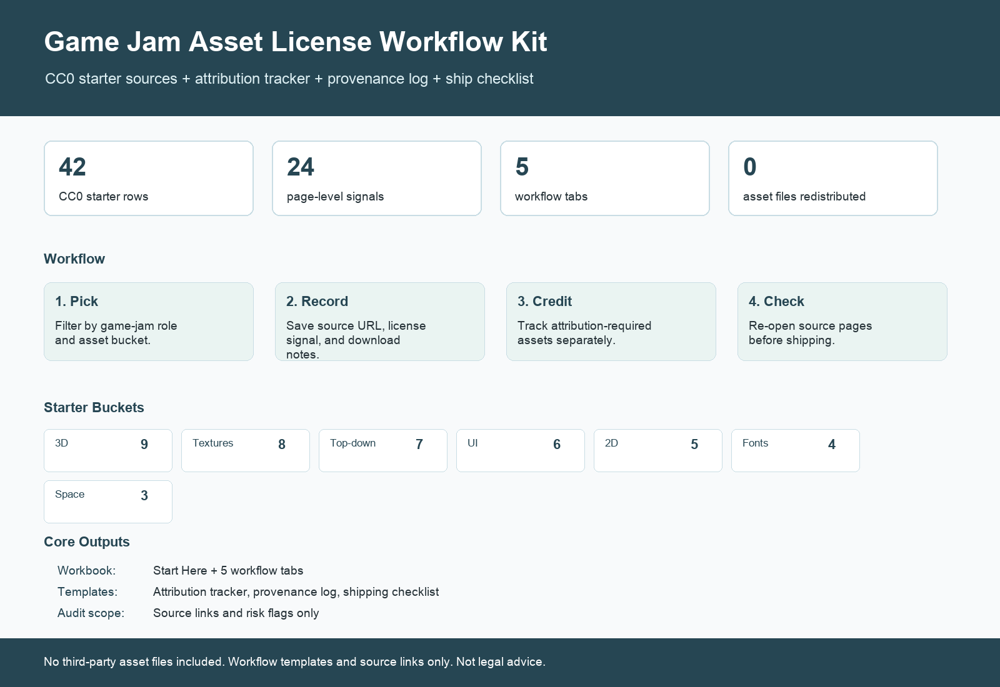

# Game Jam Asset License Workflow Kit

A free workflow kit for indie developers who need to track where game-jam or prototype assets came from, what license signals were visible, whether attribution is needed, and what to re-check before shipping.

It links to original creator/source pages. It does not include or redistribute third-party asset files, and it is not legal advice.

## Download

- **Newest font-license pack:** https://github.com/sj2025506282-creator/free-commercial-use-game-asset-audit-sheet/releases/tag/game-font-license-pack-v0.2.0
- **Download the full workflow kit ZIP:** https://github.com/sj2025506282-creator/free-commercial-use-game-asset-audit-sheet/releases/download/workflow-kit-v0.1.0/game_jam_asset_license_workflow_kit_v0.1.zip
- **Download the Google Sheets / Excel workbook:** https://github.com/sj2025506282-creator/free-commercial-use-game-asset-audit-sheet/releases/download/workflow-kit-v0.1.0/game_jam_asset_license_workflow_kit_v0.1.xlsx
- Release page: https://github.com/sj2025506282-creator/free-commercial-use-game-asset-audit-sheet/releases/tag/workflow-kit-v0.1.0

Start with the ZIP if you want all templates. Start with the XLSX if you only want the workbook.

## New: Game Font License Source Pack v0.2

The strongest current free information pack is the font-license pack:

- 47 verified font/source rows.
- 0 discovery rows counted in the public claim.
- Source URL and evidence URL for every row.
- Filterable XLSX workbook.
- Unity / Godot / Unreal notes.
- Reserved font name risk, logo-use warning, glyph coverage note, recommended-for, and avoid-for fields.
- Local audit report: `verified_count = 47`, `status = pass`.

Download:

https://github.com/sj2025506282-creator/free-commercial-use-game-asset-audit-sheet/releases/tag/game-font-license-pack-v0.2.0

Use this before shipping a game that embeds or distributes font files. It is not legal advice and does not redistribute font files.

## Paid Option

If you want the expanded paid preview, the Gumroad Pro Preview is here:

https://3813941972097.gumroad.com/l/grjtiq

It includes 75 total asset tracker rows, 25 Pro-only extra rows, a Pro Preview workbook, buyer README, and changelog.

The paid version sells the audit work, filtering, source notes, and risk flags. It does not sell or redistribute third-party asset files.

There is also a paid workflow pack for people who want to audit their own game asset folder:

https://3813941972097.gumroad.com/l/isavr

It includes an asset inventory template, source/provenance log, attribution tracker, font review template, before-shipping checklist, filterable XLSX workbook, 30-minute audit workflow, and a filled example audit.

Launch code: use `REDDIT40` for 40% off. Limited to the first 10 uses.

If the free font pack helps, the $9 template pack is the paid workflow layer: use it to audit your own asset folder, not just fonts.

## Small Audit Service

I am also testing a small manual service for indie developers:

**$19 starter audit:** send up to 10 asset/source URLs and get a short review with license-signal notes, attribution-risk flags, and before-shipping questions.

This is not legal advice and does not replace a lawyer. It is a practical pre-shipping checklist pass for game jam or prototype assets.

## What's Included

- `game_jam_asset_license_workflow_kit_v0.1.xlsx`: workbook with Start Here, CC0 Starter, Attribution Tracker, Provenance Log, Font Checklist, and Before Shipping tabs.
- `game_jam_asset_license_workflow_kit_v0.1.zip`: all workflow kit files in one download.
- `cc0_starter_sources_v0.1.csv`: 42 CC0/no-attribution/no-signup starter source rows.
- `attribution_tracker_template_v0.1.csv`: template for CC BY or attribution-required assets.
- `provenance_log_template_v0.1.csv`: source/download/license evidence log template.
- `font_license_checklist_v0.1.csv`: font-specific checklist for embedding, modification, logo/brand use, and redistribution questions.
- `before_shipping_checklist_v0.1.csv`: final review checklist before publishing a build.

Current strict audit status: `conditional_pass`. See `game-jam-asset-license-workflow-kit-v0.1/AUDIT_NOTES.md`.

## What This Helps With

- Finding low-friction CC0/no-attribution sources for prototypes and jams.
- Keeping attribution-required assets out of the "I forgot where this came from" pile.
- Recording source URLs, license signals, download notes, and review status.
- Separating font checks from general art/audio asset checks.
- Doing a final before-shipping review without pretending the sheet is legal clearance.

## Asset-License Traps Checklist

There is also a small free checklist package for pre-shipping review:

- `game-asset-license-traps-checklist-v0.1/`: 7 common asset-license traps, red-flag CSV, font questions, provenance log, and before-shipping review table.
- `game_asset_license_traps_checklist_v0.1.zip`: zipped checklist package.

Use it before publishing a jam build, prototype, demo, or commercial release.

## Original Tracker v0.2

The broader tracker is still available for people who want the full source list:

https://github.com/sj2025506282-creator/free-commercial-use-game-asset-audit-sheet/releases/tag/v0.2.0

- `free_game_asset_license_tracker_v0.2.xlsx`: Excel/Google Sheets-ready workbook with Summary, Asset License Tracker, Font License Tracker, and Field Guide tabs.
- `game_asset_license_tracker_v0.2.csv`: Google Sheet-friendly general asset tracker with `license_family`, `evidence_level`, `last_checked`, and `public_claim`.
- `font_license_tracker_v0.2.csv`: font-specific tracker with fields for embedding, modification, logo/brand use, editorial vs commercial use, and redistribution risk.
- `preview_license_tracker_v0.2.png`: visual preview for Reddit/social posts.

## Pro Preview Details

The free tracker is the main public version.

There is also a small paid Pro Preview for people who want the expanded workbook:

- 75 total asset tracker rows.
- 25 Pro-only extra rows beyond the free tracker.
- CC0 Signals tab.
- Pro Extra Rows tab.
- Buyer README and changelog.

Gumroad: https://3813941972097.gumroad.com/l/grjtiq

The Pro Preview sells the audit structure, filtering, source notes, and risk flags. It does not sell or redistribute third-party asset files.

## CC0-only Game Jam Starter

There is also a narrower free companion package for game jams:

- `cc0-game-jam-starter-v0.1/cc0_game_jam_starter_v0.1.xlsx`: workbook with Summary, CC0 Starter, Game Jam Checklist, and Source Notes tabs.
- `cc0-game-jam-starter-v0.1/cc0_game_jam_starter_v0.1.csv`: Google Sheets-friendly CC0-only starter table.
- `cc0-game-jam-starter-v0.1/preview_cc0_game_jam_starter_v0.1.png`: preview image for Reddit/social posts.

This companion filters the v0.2 tracker down to rows with commercial-use, no-attribution, no-signup, and CC0/public-domain signals. It does not redistribute third-party asset files and is not legal advice.

## Google Sheets Import

Recommended path:

1. Download `free_game_asset_license_tracker_v0.2.xlsx`.
2. Open Google Sheets.
3. Use `File > Import > Upload`.
4. Import as a new spreadsheet.
5. Keep filters enabled on the tracker tabs.

## Audit Status Meaning

- `verified_collection_policy`: the creator or platform states a broad license policy that covers its listed asset pages.
- `verified_page_signal`: the page title or listing includes an explicit license signal such as CC0.
- `directory_signal_only`: the asset was found through a CC0/free directory filter, but the individual page should be checked again before recommending it as final.
- `source_reference_only`: useful license/profile/reference page, but not a direct asset-pack row.
- `discovery_pool_only`: useful place to find future rows, but not a verified asset row.

## Commercial-Use Notes

- CC0/public domain sources are usually the cleanest for game jams and commercial prototypes.
- CC BY sources can be useful but need attribution tracking.
- Font licensing needs its own checks: embedding in a game/app, modification, logo/brand usage, and editorial vs commercial use are separate questions.
- Avoid NC, ND, unclear custom licenses, and pages that do not explicitly state whether commercial use is allowed.
- Even with CC0, keep a source log for provenance and future takedown/dispute handling.

## Files

- `commercial_use_game_asset_sources_audit_v0.1.csv`: the original v0.1 audit sheet.
- `free_game_asset_license_tracker_v0.2.xlsx`: the v0.2 workbook.
- `game_asset_license_tracker_v0.2.csv`: the v0.2 general tracker.
- `font_license_tracker_v0.2.csv`: the v0.2 font licensing tracker.
- `preview_license_tracker_v0.2.png`: visual preview.
- `reddit_post_draft.md`: a draft Reddit post for feedback/testing.
- `AUDIT_REPORT.md`: strict audit notes and public-claim limits.
- `cc0-game-jam-starter-v0.1/`: narrow CC0-only game-jam companion package.
- `game-jam-asset-license-workflow-kit-v0.1/`: productized workflow kit with attribution/provenance/checklist templates.
- `pro-draft/`: Gumroad Pro Preview package, cover media, buyer README, changelog, and strict review notes.
