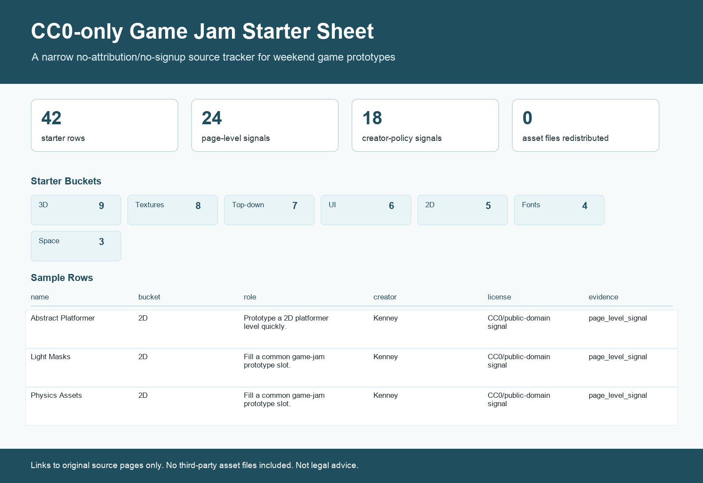

# CC0-only Game Jam Starter Sheet

This is a narrow companion to the broader Free Game Asset License Tracker. It filters the v0.2 tracker down to asset pages that are useful for quick game-jam prototypes and currently match all of these signals:

- commercial use: yes
- attribution required: no
- download signup: no
- license family: CC0/public-domain signal
- evidence level: page-level signal or creator-policy signal

## Files

- `cc0_game_jam_starter_v0.1.xlsx`: workbook with Summary, CC0 Starter, Game Jam Checklist, and Source Notes tabs.
- `cc0_game_jam_starter_v0.1.csv`: Google Sheets-friendly starter table.
- `preview_cc0_game_jam_starter_v0.1.png`: preview image for Reddit/social posts.
- `AUDIT_NOTES.md`: strict review notes and public-claim limits.
- `reddit_post_draft.md`: draft post copy.

## Included Scope

- 42 starter rows.
- 24 page-level license signals.
- 18 creator-policy license signals.
- 0 third-party asset files redistributed.

## Starter Buckets

- 3D: 9 rows
- Textures: 8 rows
- Top-down: 7 rows
- UI: 6 rows
- 2D: 5 rows
- Fonts: 4 rows
- Space: 3 rows

## Creator/Platform Mix

- Kenney: 18 rows
- Screaming Brain Studios: 18 rows
- GGBotNet: 6 rows

## Evidence Mix

- page_level_signal: 24 rows
- creator_policy_signal: 18 rows

## Public Claim

Use this wording:

> A CC0-only game-jam starter sheet with source links, provenance notes, and risk flags. It does not redistribute third-party asset files and is not legal advice.

Avoid stronger wording such as "legally safe", "guaranteed", or "fully cleared".
